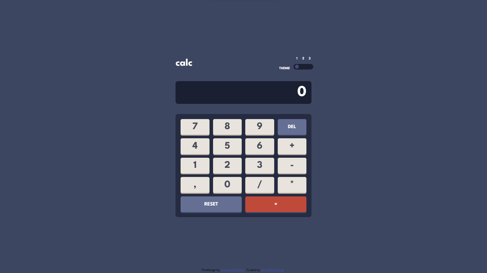

# Frontend Mentor - Calculator app solution

This is a solution to the [Calculator app challenge on Frontend Mentor](https://www.frontendmentor.io/challenges/calculator-app-9lteq5N29). Frontend Mentor challenges help you improve your coding skills by building realistic projects.

## Table of contents

- [Overview](#overview)
  - [The challenge](#the-challenge)
  - [Screenshot](#screenshot)
  - [Links](#links)
- [My process](#my-process)
  - [Built with](#built-with)
  - [What I learned](#what-i-learned)
  - [Continued development](#continued-development)
  - [Useful resources](#useful-resources)
- [Author](#author)
- [Acknowledgments](#acknowledgments)

**Note: Delete this note and update the table of contents based on what sections you keep.**

## Overview

### The challenge

Users should be able to:

- See the size of the elements adjust based on their device's screen size
- Perform mathmatical operations like addition, subtraction, multiplication, and division
- Adjust the color theme based on their preference
- **Bonus**: Have their initial theme preference checked using `prefers-color-scheme` and have any additional changes saved in the browser

### Screenshot

### Links

- Solution URL: [Open Code](https://github.com/RaidEyes/Calculator-App-Javascript/settings/pages)
- Live Site URL: [Live](https://raideyes.github.io/Calculator-App-Javascript/)

## My process

### Built with

- Semantic HTML5 markup
- CSS custom properties
- Flexbox
- CSS Grid
- Mobile-first workflow
- Vanilla Javascript

### What I learned

I learnt about separating functions for their different roles instead of putting them all inside of a event. This is a good practice since it's readable and maintainable.

### Continued development

I may continue to learn vanilla javascript on future challenges since it's very hard to master.

### Useful resources

- [Kevin Powell Channel](https://www.youtube.com/@KevinPowell)

Kevin has a good video explaining about color changing theme. I recommend you guys check him out.

## Author

- Frontend Mentor - [@yourusername](https://www.frontendmentor.io/profile/RaidEyes)

## Acknowledgments

Thanks to myself!!
